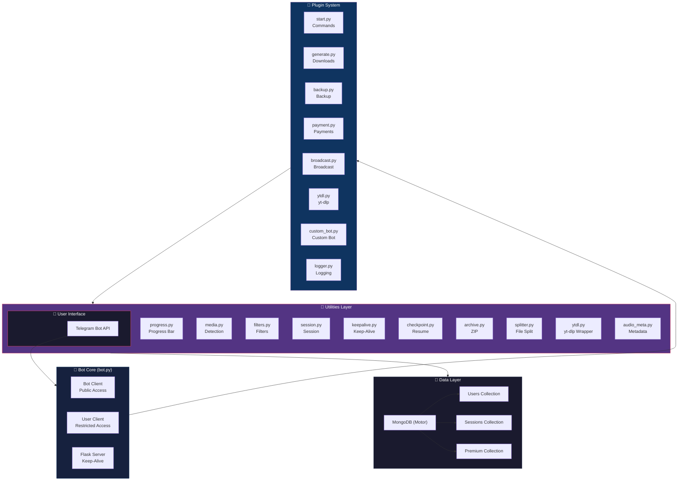
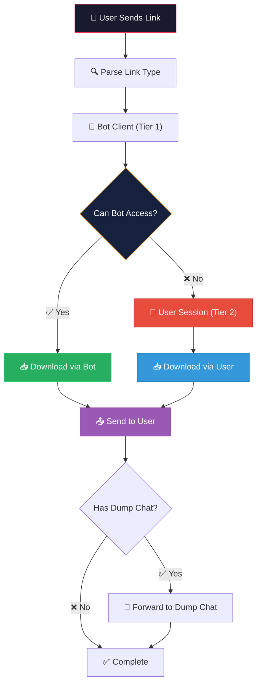
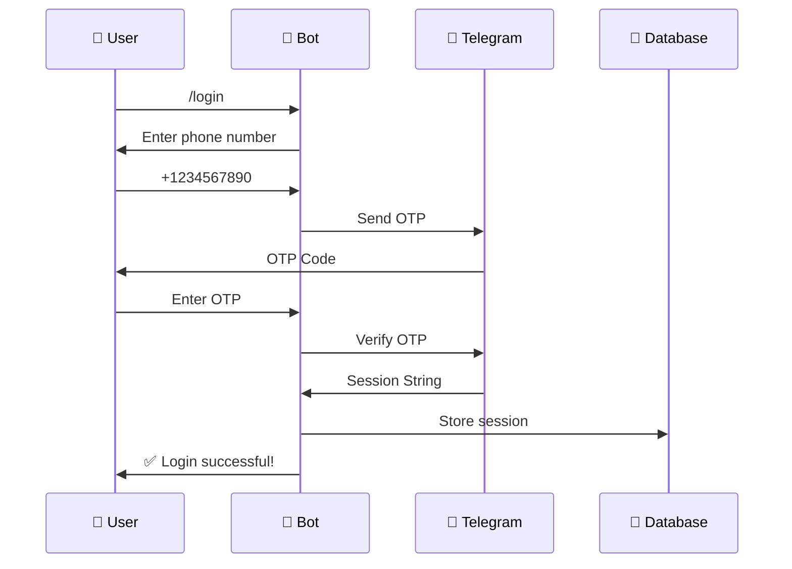
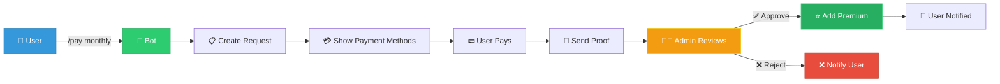
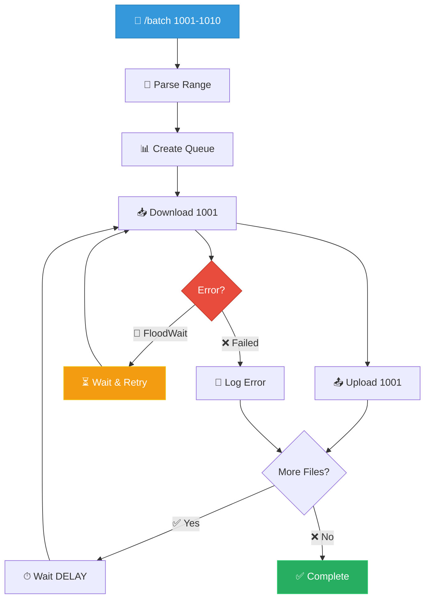
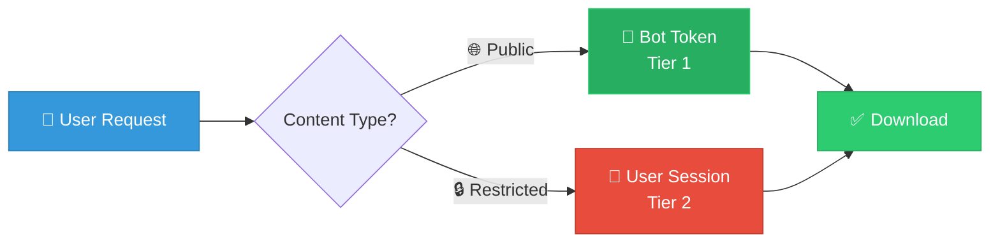
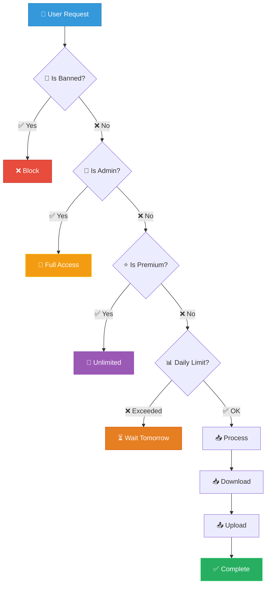
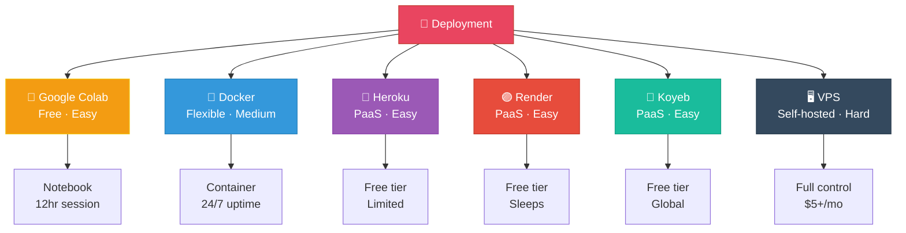
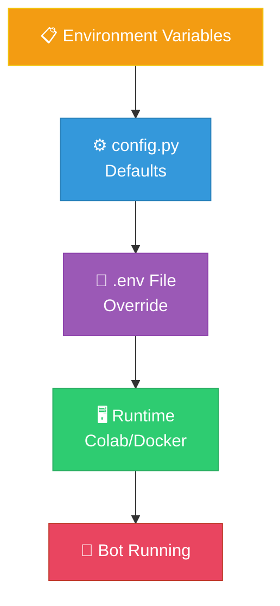

# 🏗️ Architecture

## Overview

TelegramDL is built on a modular architecture using the Kurigram (Pyrogram fork) library. The system uses a two-tier access pattern: bot token for public content, user session for restricted content.

## 📐 System Design



## 🔄 Data Flow

### Download Flow



### Authentication Flow



### Payment Flow



### Batch Download Flow



## 📦 Module Dependencies

```mermaid
graph TD
    BOT["🤖 bot.py<br/>Main Entry"] --> CONFIG["⚙️ config.py<br/>Configuration"]
    BOT --> DB["💾 database/db.py<br/>MongoDB"]
    
    BOT --> PLUGINS["🔌 plugins/"]
    BOT --> UTILS["🔧 utils/"]
    
    PLUGINS --> PSTART["start.py<br/>Commands"]
    PLUGINS --> PGEN["generate.py<br/>Downloads"]
    PLUGINS --> PBACKUP["backup.py<br/>Backup"]
    PLUGINS --> PBCAST["broadcast.py<br/>Broadcast"]
    PLUGINS --> PPAY["payment.py<br/>Payments"]
    PLUGINS --> PLOG["logger.py<br/>Logging"]
    PLUGINS --> PYTDL["ytdl.py<br/>yt-dlp"]
    PLUGINS --> PCBOT["custom_bot.py<br/>Custom Bot"]
    PLUGINS --> PSET["settings.py<br/>Settings"]
    
    UTILS --> UUI["ui.py<br/>Keyboards"]
    UTILS --> UPROG["progress.py<br/>Progress"]
    UTILS --> USESS["session.py<br/>Session"]
    UTILS --> UALIVE["keepalive.py<br/>Keep-Alive"]
    UTILS --> UCP["checkpoint.py<br/>Resume"]
    UTILS --> UMEDIA["media.py<br/>Detection"]
    UTILS --> UFILTER["filters.py<br/>Filters"]
    UTILS --> UARCH["archive.py<br/>ZIP"]
    UTILS --> USPLIT["splitter.py<br/>File Split"]
    UTILS --> UYTDL["ytdl.py<br/>yt-dlp Wrapper"]
    UTILS --> UMETA["audio_meta.py<br/>Metadata"]

    style BOT fill:#e94560,stroke:#c0392b,color:#fff
    style CONFIG fill:#f39c12,stroke:#f1c40f,color:#fff
    style DB fill:#3498db,stroke:#2980b9,color:#fff
    style PLUGINS fill:#9b59b6,stroke:#8e44ad,color:#fff
    style UTILS fill:#2ecc71,stroke:#27ae60,color:#fff
```



## 🗄️ Database Schema

### Users Collection

```json
{
  "_id": "ObjectId",
  "id": 123456789,
  "name": "Username",
  "is_premium": true,
  "premium_expiry": "2026-02-19T00:00:00Z",
  "daily_usage": 5,
  "daily_reset": "2026-01-19T00:00:00Z",
  "total_saves": 150,
  "session_string": "1BVtsO8...",
  "thumbnail": "AgACAgIA...",
  "caption": "📁 {filename}",
  "dump_chat": "-1001234567890",
  "bot_token": "123456:ABC...",
  "rename_tag": "backup_",
  "delete_words": ["ad", "promo"],
  "replace_words": {"old": "new"},
  "topic_id": 123,
  "banned": false,
  "created_at": "2026-01-01T00:00:00Z"
}
```

### Payment Requests Collection

```json
{
  "_id": "ObjectId",
  "payment_request": true,
  "user_id": 123456789,
  "request_id": "1234567890_1705651200",
  "plan": "monthly",
  "days": 30,
  "price": "₹149 / $3",
  "status": "pending|approved|rejected",
  "created_at": "2026-01-19T00:00:00Z",
  "updated_at": "2026-01-19T00:00:00Z"
}
```

## 🔐 Security Model

### Two-Tier Access



### Session Storage

- **LOGIN_SYSTEM=true**: Each user authenticates separately (recommended)
- **LOGIN_SYSTEM=false**: Single global session (admin's session)

### Access Control



## 🚀 Deployment Options



## 📊 Performance Considerations

### Rate Limiting

- **Default WAITING_TIME**: 10 seconds between messages
- **FloodWait Handling**: Automatic retry with exponential backoff
- **Concurrent Downloads**: Configurable (default: 3)

### Memory Management

- **File Splitting**: Large files (>2GB) split automatically
- **Checkpoint System**: Saves progress every 50 files
- **Auto-Cleanup**: Temporary files deleted after upload

### Database Optimization

- **Indexed Queries**: User ID indexed for fast lookups
- **Async Operations**: Motor async driver for non-blocking I/O
- **Connection Pooling**: Automatic connection management

## 🔧 Configuration Hierarchy



## 📈 Scalability

### Horizontal Scaling

- Multiple bot instances can run simultaneously
- MongoDB supports replica sets for high availability
- Load balancing via Docker Compose or Kubernetes

### Vertical Scaling

- Increase WAITING_TIME for rate limiting
- Adjust PARALLEL_DOWNLOADS for throughput
- Scale MongoDB resources for more users

## 🧪 Testing

### Manual Testing

```bash
# Test bot commands
/start
/help
/login
/dl <public_link>

# Test restricted content
/dl <private_link>

# Test admin commands
/broadcast <message>
/ban <user_id>
```

### Load Testing

```bash
# Simulate multiple users
for i in {1..100}; do
  python3 -c "import asyncio; from bot import bot; asyncio.run(bot.start())" &
done
```

---

**Last Updated**: 2026-01-19
