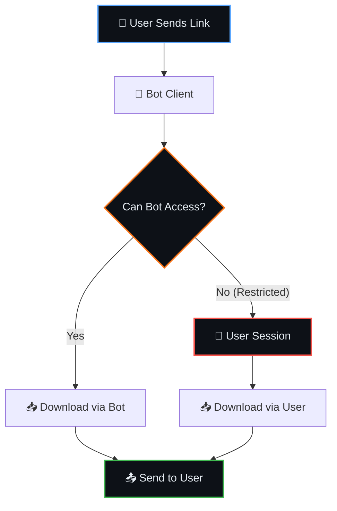

<div align="center">


<br/>

[](https://colab.research.google.com/github/Shineii86/TelegramDL/blob/main/notebook/TelegramDL.ipynb)

<br/>

[](https://github.com/Shineii86/TelegramDL/stargazers)
[](https://github.com/Shineii86/TelegramDL/network/members)
[](https://github.com/Shineii86/TelegramDL/issues)
[](https://github.com/Shineii86/TelegramDL/pulls)
[](https://github.com/Shineii86/TelegramDL/commits/main)
[](https://github.com/Shineii86/TelegramDL)
[](https://github.com/Shineii86/TelegramDL/blob/main/LICENSE)
[](https://github.com/Shineii86/TelegramDL)

<br/>

[](https://www.python.org/)
[](https://github.com/KurimuzonAkuma/kurigram)
[](LICENSE)

<br/>

**Download Restricted Telegram Content via Bot · Save Locally · Backup to Channel**

Open notebook in Google Colab, fill credentials, run — done. Handles restricted channels, groups, bots, and stories with user session authentication.

**Tags:** `telegram` `restricted-content` `bot` `downloader` `colab` `kurigram` `pyrogram` `backup` `stories` `groups` `bots`

</div>

---

## 📑 Table of Contents

<details open>
<summary><b>Quick Navigation</b></summary>

<br/>

| Section | Description |
|:--------|:------------|
| [📖 Overview](#-overview) | What is TelegramDL? |
| [✨ Features](#-features) | All features at a glance |
| [📂 Project Structure](#-project-structure) | Repository layout |
| [🚀 Quick Start](#-quick-start) | Get running in 3 steps |
| [⚙️ Configuration](#%EF%B8%8F-configuration) | All settings explained |
| [🔗 Supported Formats](#-supported-formats) | ALL URL types |
| [🧠 How It Works](#-how-it-works) | Step-by-step flow |
| [🤖 Bot Commands](#-bot-commands) | All commands |
| [💳 Premium](#-premium) | Plans & payments |
| [🔋 Colab Guide](#-colab-guide) | Tips & optimizations |
| [📚 Documentation](#-documentation) | Full docs index |
| [❓ FAQ](#-faq) | Common questions |
| [🐛 Troubleshooting](#-troubleshooting) | Fix common issues |
| [🙏 Acknowledgements](#-acknowledgements) | Credits |
| [📜 License](#-license) | MIT license |

</details>

---

## 📖 Overview

TelegramDL is a **Telegram Restricted Content Downloader** that lets you download photos, videos, audio, documents, and stories from any Telegram source — including **channels, groups, supergroups, bots, and stories**. Built with Kurigram (Pyrogram fork) and Google Colab notebook for easy usage.

> [!NOTE]
> **Why TelegramDL?** Telegram doesn't allow downloading from restricted channels. TelegramDL solves this by using a two-tier approach: bot token for public content, user session for restricted content.

> [!WARNING]
> **Rate Limits**: Telegram has rate limits. Built-in delays (default 10s) protect your account from bans.

### ✨ Key Features

| Feature | Description |
|---------|-------------|
| 🔒 **Restricted Content** | Download from private/restricted channels |
| 🤖 **Bot + User Session** | Two-tier access: bot first → user fallback |
| 📱 **Local Download** | Save to Colab/Drive/storage |
| ☁️ **Channel Backup** | Backup to private Telegram channel |
| 📦 **Batch Download** | Download message ID ranges |
| 📖 **Stories** | Download Telegram stories |
| 👥 **Groups & Supergroups** | Download from groups |
| 🤖 **Bot Chats** | Download from bot conversations |
| 🔗 **All URL Formats** | Public, private, invite, bot, story links |
| 🎨 **Modern UI** | Inline keyboards with callback buttons |
| 📊 **Live Progress** | Real-time progress bar with ETA |
| ❌ **Cancel Button** | Stop batch downloads anytime |
| 🖼️ **Thumbnail Preservation** | Keeps thumbnails for videos/documents |
| 📝 **Caption Formatting** | Preserves bold, italic, links |
| 💾 **Resume Support** | Checkpoint system for Colab disconnects |
| 📢 **Broadcast** | Admin broadcast to all users |

---

## ✨ Features

<table>
<tr>
<td width="50%" valign="top">

### 🎯 Core Features

| Feature | Status |
|---------|:------:|
| Single Message Download | ✅ |
| Batch Download | ✅ |
| Channel Backup | ✅ |
| Local Download | ✅ |
| Restricted Content | ✅ |
| Stories | ✅ |
| Groups | ✅ |
| Bot Chats | ✅ |

</td>
<td width="50%" valign="top">

### 🛡️ Safety Features

| Feature | Status |
|---------|:------:|
| Two-Tier Access | ✅ |
| FloodWait Handling | ✅ |
| Rate Limit Protection | ✅ |
| Retry Logic (3x) | ✅ |
| Cancel Button | ✅ |

</td>
</tr>
</table>

<table>
<tr>
<td width="50%" valign="top">

### 💾 Persistence Features

| Feature | Status |
|---------|:------:|
| Resume Checkpoint | ✅ |
| Auto-Save Progress | ✅ |
| Keep-Alive | ✅ |
| Session Stats | ✅ |
| Colab Optimized | ✅ |

</td>
<td width="50%" valign="top">

### 📝 Content Features

| Feature | Status |
|---------|:------:|
| Original Caption | ✅ |
| Caption Formatting | ✅ |
| Thumbnail Preservation | ✅ |
| Video Metadata | ✅ |
| Date Filter | ✅ |
| Type Filter | ✅ |
| File Size Filter | ✅ |

</td>
</tr>
</table>

<table>
<tr>
<td width="50%" valign="top">

### 🎨 UI Features

| Feature | Status |
|---------|:------:|
| Inline Keyboards | ✅ |
| Callback Buttons | ✅ |
| Live Progress Bar | ✅ |
| ETA Calculation | ✅ |
| Cancel Button | ✅ |
| Back Navigation | ✅ |

</td>
<td width="50%" valign="top">

### 🔧 Admin Features

| Feature | Status |
|---------|:------:|
| Broadcast | ✅ |
| User Management | ✅ |
| Auto-Cleanup | ✅ |
| Error Handling | ✅ |

</td>
</tr>
</table>

---

## 📂 Project Structure

```
TelegramDL/
├── CHANGELOG.md              # Version history (newest first)
├── LICENSE                   # MIT
├── README.md                 # This file
├── .gitignore                # Python, Jupyter, OS artifacts
├── .env.example              # Environment template
├── requirements.txt          # Python dependencies
├── gen_session.py            # Session string generator
├── Dockerfile                # Docker deployment
├── docker-compose.yml        # Docker Compose
├── Procfile                  # Heroku worker
├── heroku.yml                # Heroku container
├── app.json                  # Heroku deploy button
├── runtime.txt               # Python version
├── deploy.sh                 # VPS auto-deploy script
├── templates/
│   └── welcome.html          # Flask status page
├── notebook/
│   └── TelegramDL.ipynb      # Colab notebook
│
├── bot.py                    # Main entry - Bot + User client
├── config.py                 # Environment variable config
├── app.py                    # Flask keep-alive (Docker/VPS)
│
├── plugins/
│   ├── __init__.py
│   ├── start.py              # /start, /help, /login, /logout, /cancel + callbacks
│   ├── generate.py           # Core save/download logic
│   ├── backup.py             # Backup command
│   ├── broadcast.py          # Admin broadcast
│   ├── payment.py            # Premium plans & payments
│   ├── logger.py             # Full activity logging
│   ├── ytdl.py               # yt-dlp commands (/dl, /adl)
│   ├── custom_bot.py         # Custom bot per user
│   └── settings.py           # User settings
│
├── database/
│   ├── __init__.py
│   └── db.py                 # MongoDB (Motor async driver)
│
└── utils/
    ├── __init__.py
    ├── ui.py                 # Inline keyboards & message templates
    ├── progress.py           # Live progress bar with ETA
    ├── session.py            # Session time tracking
    ├── keepalive.py          # Idle prevention
    ├── checkpoint.py         # Resume support
    ├── media.py              # Media type detection
    ├── filters.py            # Date/type filters
    ├── archive.py            # ZIP creation
    ├── splitter.py           # File splitting >2GB
    ├── ytdl.py               # yt-dlp wrapper
    └── audio_metadata.py     # Audio metadata embedding
```

---

## 🚀 Quick Start

<div align="center">

[](https://colab.research.google.com/github/Shineii86/TelegramDL/blob/main/notebook/TelegramDL.ipynb)

</div>

| Step | Cell | What Happens | Duration |
|:----:|------|-------------|----------|
| 🔧 | **Step 1** | Install dependencies, clone repo | ~30 sec |
| ⚙️ | **Step 2** | Fill in credentials, configure settings | ~1 min |
| 🚀 | **Step 3** | Run the bot | Varies |
| 🔑 | **Step 4** | Generate session string (if needed) | ~1 min |

### Detailed Cell Breakdown

**Step 1 — Setup**
```python
# Install kurigram, tgcrypto, motor, Flask, gunicorn, nest_asyncio
# Clone or update TelegramDL repository
```

**Step 2 — Configuration**
```python
# Set API_ID, API_HASH, BOT_TOKEN
# Set STRING_SESSION (for restricted content)
# Configure LOGIN_SYSTEM, WAITING_TIME, MAX_FILE_SIZE_MB
# All settings saved as environment variables
```

**Step 3 — Run Bot**
```python
# Apply nest_asyncio for Colab
# Import and run the bot
# Bot starts receiving messages
```

**Step 4 — Generate Session String**
```python
# Enter API_ID, API_HASH, Phone Number
# Receive OTP, enter code
# Get session string → copy to Step 2
```

---

## 🚀 Deployment

### 📱 Google Colab (Easiest)

[](https://colab.research.google.com/github/Shineii86/TelegramDL/blob/main/notebook/TelegramDL.ipynb)

### 🐳 Docker

```bash
# Build and run
docker build -t telegramdl .
docker run -d \
  --name telegramdl \
  -e API_ID=your_api_id \
  -e API_HASH=your_api_hash \
  -e BOT_TOKEN=your_bot_token \
  -e DB_URI=your_mongodb_uri \
  -e ADMINS=your_user_id \
  -e CHANNEL_ID=-1001234567890 \
  -e LOG_CHANNEL=-1001234567890 \
  telegramdl
```

### 🐳 Docker Compose

```bash
# Create .env file first
cp .env.example .env
nano .env  # Fill in your credentials

# Start
docker-compose up -d

# View logs
docker-compose logs -f

# Stop
docker-compose down
```

### 🔶 Heroku

**Method 1: Deploy Button**
[](https://heroku.com/deploy)

**Method 2: Container Registry**
```bash
# Login to Heroku
heroku login
heroku container:login

# Create app
heroku create your-app-name

# Build and push
heroku container:push worker --app your-app-name
heroku container:release worker --app your-app-name

# Set config
heroku config:set API_ID=your_api_id API_HASH=your_api_hash BOT_TOKEN=your_bot_token --app your-app-name
```

**Method 3: Git Deploy**
```bash
# Clone and login
git clone https://github.com/Shineii86/TelegramDL.git
cd TelegramDL
heroku create your-app-name

# Set buildpack
heroku buildpacks:set heroku/python

# Deploy
git push heroku main

# Scale worker
heroku ps:scale worker=1
```

### 🟣 Render

1. Go to [render.com](https://render.com) → **New Web Service**
2. Connect your GitHub repo
3. Select **Docker** as build type
4. Choose **Free** plan
5. Add environment variables:
   - `API_ID`, `API_HASH`, `BOT_TOKEN`, `DB_URI`, `ADMINS`, `CHANNEL_ID`, `LOG_CHANNEL`
6. Click **Create Web Service**

### 🔵 Koyeb

1. Go to [koyeb.com](https://koyeb.com) → **Create New Service**
2. Select **Dockerfile** as build type
3. Connect your GitHub repo
4. Add environment variables:
   - `API_ID`, `API_HASH`, `BOT_TOKEN`, `DB_URI`, `ADMINS`, `CHANNEL_ID`, `LOG_CHANNEL`
5. Click **Deploy**

### 🖥️ VPS (Ubuntu/Debian)

```bash
# Install dependencies
sudo apt update && sudo apt install -y python3 python3-pip python3-venv ffmpeg git

# Clone repo
git clone https://github.com/Shineii86/TelegramDL.git
cd TelegramDL

# Setup virtual environment
python3 -m venv venv
source venv/bin/activate

# Install Python packages
pip install -r requirements.txt

# Create .env file
cp .env.example .env
nano .env  # Fill in your credentials

# Run with auto-restart (systemd)
sudo bash deploy.sh

# Or run manually
python3 bot.py
```

**Run in background with screen:**
```bash
screen -S telegramdl
python3 bot.py
# Detach: Ctrl+A, then Ctrl+D
# Re-attach: screen -r telegramdl
```

---

## ⚙️ Configuration

### Environment Variables

#### Required

| Variable | Description |
|----------|-------------|
| `API_ID` | Telegram API ID (from my.telegram.org) |
| `API_HASH` | Telegram API Hash (from my.telegram.org) |
| `BOT_TOKEN` | Bot token from @BotFather |

#### Database

| Variable | Default | Description |
|----------|---------|-------------|
| `DB_URI` | — | MongoDB URI (required if LOGIN_SYSTEM=true) |
| `DB_NAME` | `telegramdl` | MongoDB database name |

#### Admin

| Variable | Default | Description |
|----------|---------|-------------|
| `ADMINS` | — | Admin user IDs (comma-separated) |
| `CHANNEL_ID` | — | Auto-upload channel ID |
| `LOG_CHANNEL` | — | Activity logging channel ID |
| `ADMIN_CONTACT` | `@Shineii86` | Admin contact for support |

#### Bot Settings

| Variable | Default | Description |
|----------|---------|-------------|
| `LOGIN_SYSTEM` | `true` | Per-user login vs global session |
| `STRING_SESSION` | — | User session string (if LOGIN_SYSTEM=false) |
| `WAITING_TIME` | `10` | Seconds between messages |
| `ERROR_MESSAGE` | `true` | Show error messages |

#### Download Settings

| Variable | Default | Description |
|----------|---------|-------------|
| `OUTPUT_DIR` | `./downloads` | Download directory |
| `MAX_FILE_SIZE_MB` | `2048` | Skip files larger than this |
| `TYPE_FILTER` | `all` | `all`, `photo`, `video`, `audio` |
| `PARALLEL_DOWNLOADS` | `3` | Max concurrent downloads |

#### Premium Settings

| Variable | Default | Description |
|----------|---------|-------------|
| `FREE_DAILY_LIMIT` | `10` | Max downloads per day (free) |
| `FREE_MAX_FILE_SIZE_MB` | `2048` | Max file size for free users |
| `PREMIUM_MAX_FILE_SIZE_MB` | `4096` | Max file size for premium users |

#### Backup Settings

| Variable | Default | Description |
|----------|---------|-------------|
| `BACKUP_TO_TELEGRAM` | `true` | Enable auto-backup |
| `FORWARD_MODE` | `true` | Use forwarding (faster) |
| `BACKUP_CHANNEL` | — | Custom backup channel |

#### Caption Settings

| Variable | Default | Description |
|----------|---------|-------------|
| `CAPTION_ENABLED` | `true` | Add captions to uploads |
| `KEEP_ORIGINAL_CAPTION` | `true` | Preserve source caption |

#### Keep-Alive & Session

| Variable | Default | Description |
|----------|---------|-------------|
| `KEEP_ALIVE` | `true` | Prevent idle timeout |
| `KEEP_ALIVE_INTERVAL` | `30` | Keep-alive ping interval (min) |
| `USE_CHECKPOINT` | `true` | Save progress for resume |
| `SESSION_LIMIT_HOURS` | `12` | Colab session limit |

---

## 🔗 Supported Formats

| Format | Example | Works Without Member? |
|:------:|---------|:---------------------:|
| **Public Channel** | `https://t.me/durov/123` | ✅ Yes (bot) |
| **Story** | `https://t.me/Shineii86/s/70` | ✅ Yes (bot) |
| **Batch Range** | `https://t.me/username/1001-1010` | Depends |
| **Private Channel** | `https://t.me/c/3821170490/123` | ⚠️ Need user session |
| **Bot Chat** | `https://t.me/b/botfather/4321` | ⚠️ Need user session |
| **Group** | `https://t.me/groupname/123` | ⚠️ Need user session |
| **Private Group** | `https://t.me/c/GROUP_ID/123` | ⚠️ Need user session |
| **Invite Link** | `https://t.me/+invitehash` | ✅ Auto-join |
| **Join Chat** | `https://t.me/joinchat/hash` | ✅ Auto-join |
| **Username** | `durov` | ✅ Yes (bot) |
| **Numeric ID** | `-1003983952160/123` | ⚠️ Need user session |

---

## 🧠 How It Works



### Two-Tier Access

| Tier | Client | When Used |
|:----:|--------|-----------|
| **Tier 1** | Bot Token | Public channels, unrestricted content |
| **Tier 2** | User Session | Private channels, restricted content, stories |

---

## 🤖 Bot Commands

### User Commands

| Command | Description |
|---------|-------------|
| `/start` | Start the bot, show main menu |
| `/help` | Show help with topic sections |
| `/settings` | View/adjust bot settings |
| `/login` | Login with your phone number |
| `/logout` | Logout from your session |
| `/cancel` | Cancel ongoing download |
| `/myplan` | View current plan & usage |
| `/set_thumb` | Set custom thumbnail |
| `/view_thumb` | View thumbnail |
| `/del_thumb` | Delete thumbnail |
| `/set_caption` | Set custom caption |
| `/view_caption` | View caption |
| `/del_caption` | Delete caption |

### Premium Commands

| Command | Description |
|---------|-------------|
| `/premium` | View premium plans |
| `/pay <plan>` | Request premium subscription |
| `/payment` | View payment methods |

### Admin Commands

| Command | Description |
|---------|-------------|
| `/broadcast` | Broadcast to all users |
| `/ban <user_id>` | Ban user |
| `/unban <user_id>` | Unban user |
| `/add_premium <id> <days>` | Add premium to user |
| `/remove_premium <id>` | Remove premium from user |
| `/stats` | View bot statistics |

### Inline Keyboard Navigation

```
Main Menu:
📥 Download    ☁️ Backup
📦 Batch       🔐 Login
⚙️ Settings    ❓ Help

Settings Menu:
⏱ Delay       📏 File Size
🏷 Type Filter  📝 Captions
🔄 Forward     💾 Checkpoint
       🔙 Back
```

---

## 🔋 Colab Guide

### Session Limits

| Resource | Free | Pro | Pro+ |
|:--------:|:----:|:---:|:----:|
| Session | 12 hrs | 24 hrs | 24 hrs |
| Idle Timeout | 90 min | None | None |
| RAM | 12 GB | 25 GB | 51 GB |
| Disk | 80 GB | 225 GB | 225 GB |

### Tips

| Tip | Description |
|-----|-------------|
| **Use Checkpoint** | Auto-saves every 50 files, resume after disconnect |
| **Set STRING_SESSION** | For restricted content access |
| **Adjust WAITING_TIME** | Increase if getting FloodWait errors |
| **Mount Google Drive** | For persistent storage across sessions |
| **Use File Size Filter** | Skip large files to save time/storage |
| **Use Forward Mode** | Faster than download+upload |

---

## 💳 Premium

### Plans

| Plan | Duration | Price | Features |
|------|----------|-------|----------|
| 📅 Weekly | 7 days | ₹49 / $1 | Unlimited downloads, 4GB files, Priority speed |
| 📆 Monthly | 30 days | ₹149 / $3 | + Custom thumbnails |
| 🗓 Yearly | 365 days | ₹999 / $15 | + Custom captions, Dump chat |
| ♾️ Lifetime | 100 years | ₹1999 / $25 | Everything + Lifetime access |

### Payment Methods

| Method | Details |
|--------|---------|
| 💵 USDT ByBit | BSC/ERC20/TON networks |
| 🪙 TON Tonkeeper | TON/USDT wallet |
| 🇮🇳 PhonePe UPI | DM @shineii86 |
| ⭐️ Telegram Stars | @shineii86 |

### Commands

| Command | Description |
|---------|-------------|
| `/premium` | View plans |
| `/pay <plan>` | Request premium |
| `/payment` | View payment methods |
| `/myplan` | View current plan |

---

## 📚 Documentation

| Document | Description |
|----------|-------------|
| [ARCHITECTURE.md](ARCHITECTURE.md) | System design & architecture |
| [DEPLOYMENT.md](DEPLOYMENT.md) | Complete deployment guide |
| [FAQ.md](FAQ.md) | Frequently asked questions |
| [CHANGELOG.md](CHANGELOG.md) | Version history |
| [CONTRIBUTING.md](CONTRIBUTING.md) | Contribution guidelines |
| [SECURITY.md](SECURITY.md) | Security policy |
| [CODE_OF_CONDUCT.md](CODE_OF_CONDUCT.md) | Community guidelines |

---

## ❓ FAQ

<details>
<summary><b>Is this safe? Will I get banned?</b></summary>

Built-in delays (default 10s) protect your account. Bot token handles public content, user session only used for restricted content.
</details>

<details>
<summary><b>Can I download from private channels?</b></summary>

Yes, if you're a member. Generate a session string using the bot's /login command or Step 4 in Colab.
</details>

<details>
<summary><b>Can I download stories?</b></summary>

Yes! Send a story link: `https://t.me/username/s/123`
</details>

<details>
<summary><b>Can I download from groups?</b></summary>

Yes! Send a group link: `https://t.me/groupname/123`
</details>

<details>
<summary><b>Can I download from bot chats?</b></summary>

Yes! Send a bot chat link: `https://t.me/b/botusername/123` (use Plus Messenger to get message ID)
</details>

<details>
<summary><b>Can I resume after Colab disconnects?</b></summary>

Yes, checkpoint system auto-saves progress. Re-run the bot and it will continue from where it left off.
</details>

<details>
<summary><b>What's the difference between LOGIN_SYSTEM true vs false?</b></summary>

`true`: Each user authenticates with their own phone number. `false`: Uses a single global STRING_SESSION.
</details>

<details>
<summary><b>Do I need MongoDB?</b></summary>

Only if LOGIN_SYSTEM=true. If false, set STRING_SESSION directly and skip DB_URI.
</details>

---

## 🐛 Troubleshooting

| Problem | Cause | Solution |
|---------|-------|----------|
| `Channel is private` | Not a member | Join channel or use invite link |
| `Session expired` | Invalid session | Generate new session string |
| `FloodWaitError` | Rate limited | Increase WAITING_TIME |
| `Bot can't access` | Restricted content | Set STRING_SESSION |
| `File too large` | Exceeds limit | Increase MAX_FILE_SIZE_MB |
| `Login failed` | Wrong credentials | Check API_ID, API_HASH |
| `Username not found` | Non-existent username | Check spelling |
| `Story not found` | Story expired or private | Check if story is still available |

---

## 🙏 Acknowledgements

<table>
<tr>
<td width="50%" valign="top">

### 🛠️ Tools
- [Kurigram](https://github.com/KurimuzonAkuma/kurigram) — Pyrogram fork (Telegram client)
- [Google Colab](https://colab.research.google.com) — Free GPU runtime
- [Motor](https://github.com/mongodb/motor) — Async MongoDB driver

</td>
<td width="50%" valign="top">

### 📚 Resources
- [Telegram API](https://core.telegram.org) — Official Telegram API
- [my.telegram.org](https://my.telegram.org) — API credentials
- [VJ-Save-Restricted-Content](https://github.com/VJBots/VJ-Save-Restricted-Content) — Inspiration

</td>
</tr>
</table>

---

## 🤝 Contributing

Contributions are welcome! Here's how you can help:

<table>
<tr>
<td width="33%" align="center">

### 🐛 Report Bugs
Found something broken?

[Open an Issue](https://github.com/Shineii86/TelegramDL/issues)

</td>
<td width="33%" align="center">

### 💡 Suggest Features
Have an idea?

[Start a Discussion](https://github.com/Shineii86/TelegramDL/issues)

</td>
<td width="33%" align="center">

### 🔀 Submit PRs
Ready to contribute code?

[Fork & Submit](https://github.com/Shineii86/TelegramDL/fork)

</td>
</tr>
</table>

---

## 📜 License

<div align="center">

[](LICENSE)

This project is licensed under the **MIT License**.

Free to use, modify, and distribute — see the [LICENSE](LICENSE) file for details.

</div>

---

## ⭐ Star History

<div align="center">

[](https://star-history.com/#Shineii86/TelegramDL&Date)

</div>

---

## 💕 Loved My Work?
🚨 [Follow me on GitHub](https://github.com/Shineii86)

⭐ [Give a star to this project](https://github.com/Shineii86/TelegramDL)

<div align="center">
  
<a href="https://github.com/Shineii86/TelegramDL">

</a>

<i>~ For inquiries or collaborations</i>

[](https://telegram.me/Shineii86 "Contact on Telegram")
[](https://instagram.com/ikx7.a "Follow on Instagram")
[](mailto:ikx7a@hotmail.com "Send an Email")

<sup><b>Copyright © <a href="https://telegram.me/Shineii86">Shinei Nouzen</a> All Rights Reserved</b></sup>

</div>
