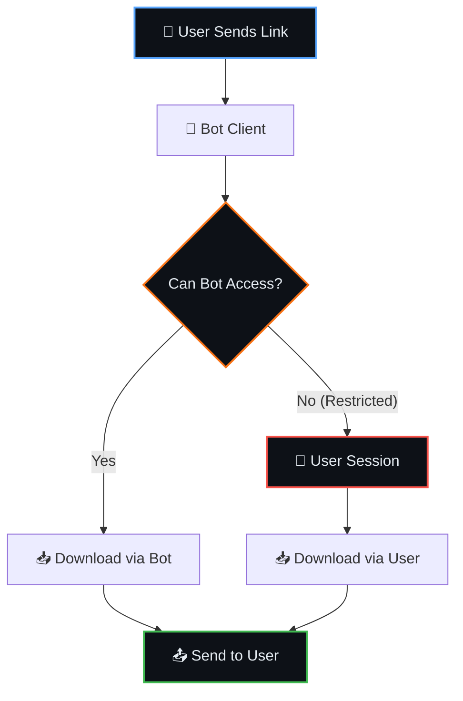

<div align="center">


<br/>

[](https://colab.research.google.com/github/Shineii86/TelegramDL/blob/main/TelegramDL.ipynb)

<br/>

[](https://github.com/Shineii86/TelegramDL/stargazers)
[](https://github.com/Shineii86/TelegramDL/network/members)
[](https://github.com/Shineii86/TelegramDL/issues)
[](https://github.com/Shineii86/TelegramDL/pulls)
[](https://github.com/Shineii86/TelegramDL/commits/main)
[](https://github.com/Shineii86/TelegramDL)

<br/>

[](https://www.python.org/)
[](https://github.com/KurimuzonAkuma/kurigram)
[](LICENSE)

<br/>

**Download Restricted Telegram Content via Bot · Save Locally · Backup to Channel**

Open notebook in Google Colab, fill credentials, run — done. Handles restricted channels with user session authentication.

**Tags:** `telegram` `restricted-content` `bot` `downloader` `colab` `kurigram` `pyrogram` `backup`

</div>

---

## 📑 Table of Contents

<details open>
<summary><b>Quick Navigation</b></summary>

<br/>

| Section | Description |
|:--------|:------------|
| [📖 Overview](#-overview) | What is TelegramDL? |
| [✨ Features](#-features) | All features at a glance |
| [📂 Project Structure](#-project-structure) | Repository layout |
| [🚀 Quick Start](#-quick-start) | Get running in 3 steps |
| [⚙️ Configuration](#%EF%B8%8F-configuration) | All settings explained |
| [🔗 Supported Formats](#-supported-formats) | URL types |
| [🧠 How It Works](#-how-it-works) | Step-by-step flow |
| [🔋 Colab Guide](#-colab-guide) | Tips & optimizations |
| [❓ FAQ](#-faq) | Common questions |
| [🐛 Troubleshooting](#-troubleshooting) | Fix common issues |
| [🙏 Acknowledgements](#-acknowledgements) | Credits |
| [📜 License](#-license) | MIT license |

</details>

---

## 📖 Overview

TelegramDL is a **Telegram Restricted Content Downloader** that lets you download photos, videos, audio, and documents from any Telegram channel — including **restricted and private channels**. Built with Kurigram (Pyrogram fork) and Google Colab notebook for easy usage.

> [!NOTE]
> **Why TelegramDL?** Telegram doesn't allow downloading from restricted channels. TelegramDL solves this by using a two-tier approach: bot token for public content, user session for restricted content.

> [!WARNING]
> **Rate Limits**: Telegram has rate limits. Built-in delays (default 10s) protect your account from bans.

### ✨ Key Features

| Feature | Description |
|---------|-------------|
| 🔒 **Restricted Content** | Download from private/restricted channels |
| 🤖 **Bot + User Session** | Two-tier access: bot first → user fallback |
| 📱 **Local Download** | Save to Colab/Drive/storage |
| ☁️ **Channel Backup** | Backup to private Telegram channel |
| 📦 **Batch Download** | Download message ID ranges |
| 🔗 **All URL Formats** | Public, private, invite links |
| 💾 **Resume Support** | Checkpoint system for Colab disconnects |
| 📅 **Date Filter** | Download by date range |
| 🏷️ **Type Filter** | Photos, videos, audio only |
| 📏 **File Size Filter** | Skip large files (default 2GB) |
| 📊 **Progress Tracking** | Real-time download progress |

---

## ✨ Features

<table>
<tr>
<td width="50%" valign="top">

### 🎯 Core Features

| Feature | Status |
|---------|:------:|
| Single Message Download | ✅ |
| Batch Download | ✅ |
| Channel Backup | ✅ |
| Local Download | ✅ |
| Restricted Content | ✅ |

</td>
<td width="50%" valign="top">

### 🛡️ Safety Features

| Feature | Status |
|---------|:------:|
| Two-Tier Access | ✅ |
| FloodWait Handling | ✅ |
| Rate Limit Protection | ✅ |
| Retry Logic | ✅ |

</td>
</tr>
</table>

<table>
<tr>
<td width="50%" valign="top">

### 💾 Persistence Features

| Feature | Status |
|---------|:------:|
| Resume Checkpoint | ✅ |
| Auto-Save Progress | ✅ |
| Colab Optimized | ✅ |

</td>
<td width="50%" valign="top">

### 📝 Content Features

| Feature | Status |
|---------|:------:|
| Original Caption | ✅ |
| Date Filter | ✅ |
| Type Filter | ✅ |
| File Size Filter | ✅ |

</td>
</tr>
</table>

---

## 📂 Project Structure

```
TelegramDL/
├── CHANGELOG.md              # Version history (newest first)
├── LICENSE                   # MIT
├── README.md                 # This file
├── .gitignore                # Python, Jupyter, OS artifacts
├── .env.example              # Environment template
├── requirements.txt          # Python dependencies
├── gen_session.py            # Session string generator
├── TelegramDL.ipynb          # Main Colab notebook (3 cells)
├── Dockerfile                # Docker deployment
├── Procfile                  # Heroku/Koyeb
├── runtime.txt               # Python version
│
├── bot.py                    # Main entry - Bot + User client
├── config.py                 # Environment variable config
├── app.py                    # Flask keep-alive (Docker)
│
├── plugins/
│   ├── __init__.py
│   ├── start.py              # /start, /help, /login, /logout, /cancel
│   └── generate.py           # Core save/download logic
│
├── database/
│   ├── __init__.py
│   └── db.py                 # MongoDB (Motor async driver)
│
└── utils/
    ├── __init__.py
    ├── progress.py           # Progress bar
    ├── checkpoint.py         # Resume support
    ├── media.py              # Media type detection
    ├── filters.py            # Date/type filters
    └── archive.py            # ZIP creation
```

---

## 🚀 Quick Start

<div align="center">

[](https://colab.research.google.com/github/Shineii86/TelegramDL/blob/main/TelegramDL.ipynb)

</div>

| Step | Cell | What Happens | Duration |
|:----:|------|-------------|----------|
| 🔧 | **Step 1** | Install dependencies, clone repo | ~30 sec |
| ⚙️ | **Step 2** | Fill in credentials, configure settings | ~1 min |
| 🚀 | **Step 3** | Run the bot | Varies |
| 🔑 | **Step 4** | Generate session string (if needed) | ~1 min |

### Detailed Cell Breakdown

**Step 1 — Setup**
```python
# Install kurigram, tgcrypto, motor, Flask, gunicorn, nest_asyncio
# Clone or update TelegramDL repository
```

**Step 2 — Configuration**
```python
# Set API_ID, API_HASH, BOT_TOKEN
# Set STRING_SESSION (for restricted content)
# Configure LOGIN_SYSTEM, WAITING_TIME, MAX_FILE_SIZE_MB
# All settings saved as environment variables
```

**Step 3 — Run Bot**
```python
# Apply nest_asyncio for Colab
# Import and run the bot
# Bot starts receiving messages
```

**Step 4 — Generate Session String**
```python
# Enter API_ID, API_HASH, Phone Number
# Receive OTP, enter code
# Get session string → copy to Step 2
```

---

## ⚙️ Configuration

### Environment Variables

| Variable | Default | Description |
|----------|---------|-------------|
| `API_ID` | — | Telegram API ID (from my.telegram.org) |
| `API_HASH` | — | Telegram API Hash (from my.telegram.org) |
| `BOT_TOKEN` | — | Bot token from @BotFather |
| `STRING_SESSION` | — | User session string (for restricted content) |
| `LOGIN_SYSTEM` | `true` | Per-user login vs global session |
| `DB_URI` | — | MongoDB URI (if LOGIN_SYSTEM=true) |
| `DB_NAME` | `telegramdl` | MongoDB database name |
| `ADMINS` | — | Admin user ID (for broadcast) |
| `CHANNEL_ID` | — | Auto-upload channel ID |
| `WAITING_TIME` | `10` | Seconds between messages |
| `ERROR_MESSAGE` | `true` | Show error messages |
| `OUTPUT_DIR` | `./downloads` | Download directory |
| `MAX_FILE_SIZE_MB` | `2048` | Skip files larger than this |
| `TYPE_FILTER` | `all` | `all`, `photo`, `video`, `audio` |

---

## 🔗 Supported Formats

| Format | Example | Works Without Member? |
|:------:|---------|:---------------------:|
| **Public URL** | `https://t.me/durov` | ✅ Yes (bot) |
| **Username** | `durov` | ✅ Yes (bot) |
| **Private Invite** | `https://t.me/+invitehash` | ✅ Auto-join |
| **Private Channel** | `https://t.me/c/3821170490/123` | ⚠️ Need user session |
| **Channel ID** | `-1003983952160` | ⚠️ Need user session |
| **Batch Range** | `https://t.me/username/1001-1010` | Depends on channel |

---

## 🧠 How It Works



### Two-Tier Access

| Tier | Client | When Used |
|:----:|--------|-----------|
| **Tier 1** | Bot Token | Public channels, unrestricted content |
| **Tier 2** | User Session | Private channels, restricted content |

---

## 🔋 Colab Guide

### Session Limits

| Resource | Free | Pro | Pro+ |
|:--------:|:----:|:---:|:----:|
| Session | 12 hrs | 24 hrs | 24 hrs |
| Idle Timeout | 90 min | None | None |
| RAM | 12 GB | 25 GB | 51 GB |
| Disk | 80 GB | 225 GB | 225 GB |

### Tips

| Tip | Description |
|-----|-------------|
| **Use Checkpoint** | Auto-saves every 50 files, resume after disconnect |
| **Set STRING_SESSION** | For restricted content access |
| **Adjust WAITING_TIME** | Increase if getting FloodWait errors |
| **Mount Google Drive** | For persistent storage across sessions |
| **Use File Size Filter** | Skip large files to save time/storage |

---

## ❓ FAQ

<details>
<summary><b>Is this safe? Will I get banned?</b></summary>

Built-in delays (default 10s) protect your account. Bot token handles public content, user session only used for restricted content.
</details>

<details>
<summary><b>Can I download from private channels?</b></summary>

Yes, if you're a member. Generate a session string using the bot's /login command or Step 4 in Colab.
</details>

<details>
<summary><b>Can I resume after Colab disconnects?</b></summary>

Yes, checkpoint system auto-saves progress. Re-run the bot and it will continue from where it left off.
</details>

<details>
<summary><b>What's the difference between LOGIN_SYSTEM true vs false?</b></summary>

`true`: Each user authenticates with their own phone number. `false`: Uses a single global STRING_SESSION.
</details>

<details>
<summary><b>Do I need MongoDB?</b></summary>

Only if LOGIN_SYSTEM=true. If false, set STRING_SESSION directly and skip DB_URI.
</details>

---

## 🐛 Troubleshooting

| Problem | Cause | Solution |
|---------|-------|----------|
| `Channel is private` | Not a member | Join channel or use invite link |
| `Session expired` | Invalid session | Generate new session string |
| `FloodWaitError` | Rate limited | Increase WAITING_TIME |
| `Bot can't access` | Restricted content | Set STRING_SESSION |
| `File too large` | Exceeds limit | Increase MAX_FILE_SIZE_MB |
| `Login failed` | Wrong credentials | Check API_ID, API_HASH |

---

## 🙏 Acknowledgements

<table>
<tr>
<td width="50%" valign="top">

### 🛠️ Tools
- [Kurigram](https://github.com/KurimuzonAkuma/kurigram) — Pyrogram fork (Telegram client)
- [Google Colab](https://colab.research.google.com) — Free GPU runtime
- [Motor](https://github.com/mongodb/motor) — Async MongoDB driver

</td>
<td width="50%" valign="top">

### 📚 Resources
- [Telegram API](https://core.telegram.org) — Official Telegram API
- [my.telegram.org](https://my.telegram.org) — API credentials
- [VJ-Save-Restricted-Content](https://github.com/VJBots/VJ-Save-Restricted-Content) — Inspiration

</td>
</tr>
</table>

---

## 🤝 Contributing

Contributions are welcome! Here's how you can help:

<table>
<tr>
<td width="33%" align="center">

### 🐛 Report Bugs
Found something broken?

[Open an Issue](https://github.com/Shineii86/TelegramDL/issues)

</td>
<td width="33%" align="center">

### 💡 Suggest Features
Have an idea?

[Start a Discussion](https://github.com/Shineii86/TelegramDL/issues)

</td>
<td width="33%" align="center">

### 🔀 Submit PRs
Ready to contribute code?

[Fork & Submit](https://github.com/Shineii86/TelegramDL/fork)

</td>
</tr>
</table>

---

## 📜 License

<div align="center">

[](LICENSE)

This project is licensed under the **MIT License**.

Free to use, modify, and distribute — see the [LICENSE](LICENSE) file for details.

</div>

---

## ⭐ Star History

<div align="center">

[](https://star-history.com/#Shineii86/TelegramDL&Date)

</div>

---

## 💕 Loved My Work?
🚨 [Follow me on GitHub](https://github.com/Shineii86)

⭐ [Give a star to this project](https://github.com/Shineii86/TelegramDL)

<div align="center">
  
<a href="https://github.com/Shineii86/TelegramDL">

</a>

<i>~ For inquiries or collaborations</i>

[](https://telegram.me/Shineii86 "Contact on Telegram")
[](https://instagram.com/ikx7.a "Follow on Instagram")
[](mailto:ikx7a@hotmail.com "Send an Email")

<sup><b>Copyright © <a href="https://telegram.me/Shineii86">Shinei Nouzen</a> All Rights Reserved</b></sup>

</div>
